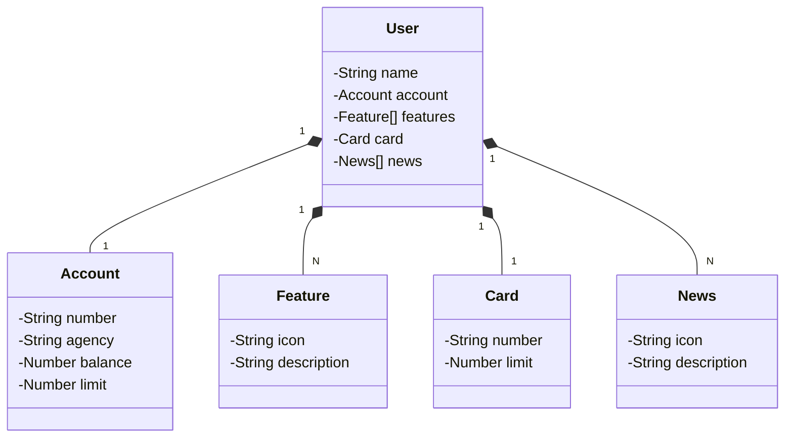

# Santander Bootcamp 2025 - Java


Java RESTful API criada para o Santander Bootcamp 2025.

## Principais Tecnologias

- **Java 17**: Utilizaremos a versão LTS mais recente do Java para tirar vantagem das últimas inovações que essa linguagem robusta e amplamente utilizada oferece;
- **Spring Boot 3**: Trabalharemos com a mais nova versão do Spring Boot, que maximiza a produtividade do desenvolvedor por meio de sua poderosa premissa de autoconfiguração;
- **Spring Data JPA**: Exploraremos como essa ferramenta pode simplificar nossa camada de acesso aos dados, facilitando a integração com bancos de dados SQL;
- **Spring Validation**: Validação de dados de entrada usando Bean Validation;
- **OpenAPI (Swagger)**: Vamos criar uma documentação de API eficaz e fácil de entender usando a OpenAPI (Swagger), perfeitamente alinhada com a alta produtividade que o Spring Boot oferece;
- **Lombok**: Redução de boilerplate code (opcional);
- **Railway**: facilita o deploy e monitoramento de nossas soluções na nuvem, além de oferecer diversos bancos de dados como serviço e pipelines de CI/CD.

## Melhorias Implementadas

### Arquitetura e Boas Práticas
- **DTOs (Data Transfer Objects)**: Separação entre camadas de apresentação e domínio usando `UserRequestDTO` e `UserResponseDTO`
- **Mappers**: Classe `UserMapper` para conversão entre entidades e DTOs
- **Exceções Customizadas**: `UserNotFoundException` e `AccountAlreadyExistsException` para melhor tratamento de erros
- **Validação de Dados**: Validações com Bean Validation nos modelos e DTOs

### Funcionalidades
- **CRUD Completo**: Endpoints GET (listar todos e por ID), POST, PUT e DELETE
- **Versionamento de API**: Endpoints versionados (`/api/v1/users`)
- **Tratamento de Exceções**: `GlobalExceptionHandler` melhorado com tratamento específico para cada tipo de exceção
- **Validação de Entrada**: Validação automática de dados de entrada com mensagens de erro detalhadas

### Documentação
- **OpenAPI/Swagger Melhorado**: Documentação completa com anotações em todos os endpoints e modelos
- **Exemplos e Descrições**: Documentação detalhada com exemplos para facilitar o uso da API

### Configurações
- **CORS**: Configuração de CORS para permitir requisições de diferentes origens
- **Logging**: Logging estruturado com diferentes níveis (DEBUG, INFO, WARN, ERROR)
- **Profiles**: Configurações separadas para desenvolvimento (H2) e produção (PostgreSQL)

## Endpoints da API

### Usuários

| Método | Endpoint | Descrição |
|--------|----------|-----------|
| GET | `/api/v1/users` | Lista todos os usuários |
| GET | `/api/v1/users/{id}` | Busca usuário por ID |
| POST | `/api/v1/users` | Cria um novo usuário |
| PUT | `/api/v1/users/{id}` | Atualiza um usuário existente |
| DELETE | `/api/v1/users/{id}` | Remove um usuário |

### Documentação Interativa

- **Swagger UI**: `http://localhost:8080/swagger-ui.html`
- **OpenAPI JSON**: `http://localhost:8080/api-docs`

## [Link do Figma](https://www.figma.com/file/0ZsjwjsYlYd3timxqMWlbj/SANTANDER---Projeto-Web%2FMobile?type=design&node-id=1421%3A432&mode=design&t=6dPQuerScEQH0zAn-1)

O Figma foi utilizado para a abstração do domínio desta API, sendo útil na análise e projeto da solução.

## Diagrama de Classes (Domínio da API)



## Como Executar

### Pré-requisitos
- Java 17 ou superior
- Gradle 8.0 ou superior

### Executando a aplicação

```bash
# Clonar o repositório
git clone <url-do-repositorio>
cd santander-bootcamp_2025

# Executar com Gradle
./gradlew bootRun

# Ou compilar e executar
./gradlew build
java -jar build/libs/santander_bootcamp_2025-java-0.0.1-SNAPSHOT.jar
```

A aplicação estará disponível em `http://localhost:8080`

### Acessando a documentação

- **Swagger UI**: http://localhost:8080/swagger-ui.html
- **OpenAPI JSON**: http://localhost:8080/api-docs
- **H2 Console** (dev): http://localhost:8080/h2-console

## Estrutura do Projeto

```
src/
├── main/
│   ├── java/me/dio/
│   │   ├── Application.java
│   │   ├── config/
│   │   │   └── WebConfig.java
│   │   ├── controller/
│   │   │   ├── exception/
│   │   │   │   └── GlobalExceptionHandler.java
│   │   │   └── UserController.java
│   │   ├── domain/
│   │   │   ├── exception/
│   │   │   │   ├── AccountAlreadyExistsException.java
│   │   │   │   └── UserNotFoundException.java
│   │   │   ├── model/
│   │   │   │   ├── Account.java
│   │   │   │   ├── BaseItem.java
│   │   │   │   ├── Card.java
│   │   │   │   ├── Feature.java
│   │   │   │   ├── News.java
│   │   │   │   └── User.java
│   │   │   └── repository/
│   │   │       └── UserRepository.java
│   │   ├── dto/
│   │   │   ├── UserRequestDTO.java
│   │   │   └── UserResponseDTO.java
│   │   ├── mapper/
│   │   │   └── UserMapper.java
│   │   └── service/
│   │       ├── UserService.java
│   │       └── impl/
│   │           └── UserServiceImpl.java
│   └── resources/
│       ├── application.yml
│       ├── application-dev.yml
│       └── application-prd.yml
└── test/
    └── java/me/dio/
        └── SantanderDevWeek2023ApplicationTests.java
```

## IMPORTANTE

Este projeto foi construído com um viés totalmente educacional para a DIO. Por isso, disponibilizamos uma versão mais robusta dele no repositório oficial da DIO:

### [digitalinnovationone/santander-dev-week-2023-api](https://github.com/digitalinnovationone/santander-dev-week-2023-api)

Lá incluímos todas os endpoints de CRUD, além de aplicar boas práticas (uso de DTOs e refinamento na documentação da OpenAPI). Sendo assim, caso queira um desafio/referência mais completa é só acessar o repositório oficial.
